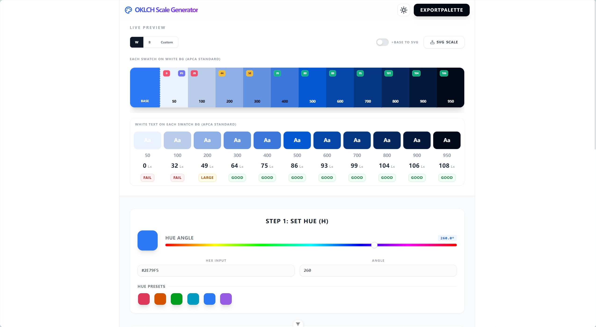

# OKLCH Scale Generator 🎨

A modern, high-precision color scale generator based on the **OKLCH** color space and **APCA** contrast algorithm. Designed for designers and developers to create perceptually balanced, accessible, and wide-gamut color systems.



## ✨ Features

- **Perceptual Balance**: Leverages OKLCH for uniform lightness and chroma adjustments.
- **APCA Contrast Analysis**: Real-time accessibility checks using the Advanced Perceptual Contrast Algorithm.
- **Dynamic Chroma Control**: Fine-tune saturation curves with peak chroma and taper settings.
- **High Precision**: Lightness and Chroma controls support up to 3 decimal places.
- **Export & Integration**:
  - **CSS**: Support for custom variable prefixes and dynamic `--hue` injection.
  - **JSON**: DTCG (Design Tokens Community Group) standard compatible output.
  - **SVG**: Direct copy-paste into design tools with embedded contrast & color info.
- **Cross-Device Modern UI**: Mobile-first responsive design with glassmorphism aesthetics and smooth animations.
- **State Persistence**: Automatic `localStorage` backup for all configurations (hue, steps, custom contrast colors).

## 🚀 Tech Stack

- **Framework**: [Vue 3](https://vuejs.org/) (Composition API)
- **State Management**: [Pinia](https://pinia.vuejs.org/)
- **Styling**: [UnoCSS](https://unocss.dev/) & Tailwind (Vanilla CSS for custom components)
- **Color Logic**: [Apcach](https://apcach.com/) (APCA calculations) & [Culori](https://culori.org/)
- **Utilities**: [VueUse](https://vueuse.org/)
- **Build Tool**: [Vite](https://vitejs.dev/)
- **Runtime**: [Bun](https://bun.sh/) (Recommended)

## 🛠️ Getting Started

### Prerequisites

Ensure you have [Bun](https://bun.sh/) installed (or Node.js 18+).

### Installation

1. Clone the repository:

   ```bash
   git clone https://github.com/your-username/oklch-sg.git
   cd oklch-sg/app
   ```

2. Install dependencies:
   ```bash
   bun install
   ```

### Development

Run the development server:

```bash
bun run dev
```

### Build for Production

Generate an optimized production build:

```bash
bun run build
```

The output will be in the `/dist` directory.

## 🚢 Deployment

### Static Hosting (Recommended)

Since this is a client-side Vite app, you can deploy it to any static hosting provider:

- **Vercel / Netlify**: Connect your GitHub repo and set the build command to `bun run build` and output directory to `dist`.
- **GitHub Pages**: Use the `vite-plugin-gh-pages` or a custom GitHub Action to deploy the `dist` folder.
- **Cloudflare Pages**: Run `bun run build` and point to the `dist` directory.

## 🧪 Accessibility (APCA)

This tool prioritizes modern accessibility standards. APCA (Advanced Perceptual Contrast Algorithm) is the successor to WCAG 2.0 contrast checks, specifically tuned for how the human eye perceives light on digital displays.

- **Lc (Lightness Contrast)**: Look for values ≥ 60 for body text and ≥ 45 for large text.

## 📄 License

MIT License - feel free to build and expand upon this!

---

Made with ❤️ for the design engineering community.
